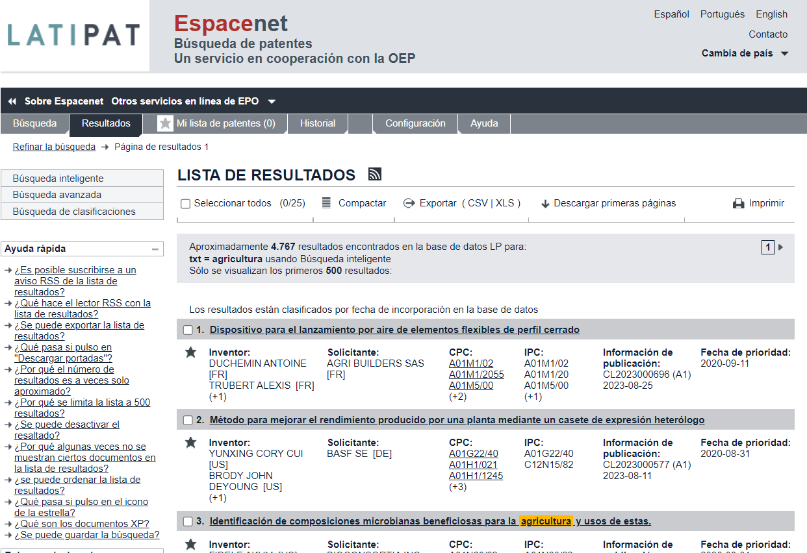



## Introduccion y Objetivos

En esta leccion aprenderemos a implementar el paquete de Python _selenium_ para automatizar nuestro acceso a paginas web y la extraccion de datos. Al final de esta leccion usted va a poder

- utilizar la funcion de Webdriver del paquete Selenium
- Interactuar con una pagina web de una manera automatizada
- Exportar los datos adquiridos para futuro uso en su analisis en formato CSV (Comma separated values - formato 'default' de Microsoft Excel)

Para llevar acabo nuestro analisis estaremos analizando la pagina <a href="https://lp.espacenet.com/?locale=es_LP">Latipat</a> la cual es una coleccion de patentes a traves de los paises iberoamericanos. En esta pagina someteremos una busqueda para patentes que tengan que ver con la industria agricola y vamos a extraer los titulos y resumen (abstract) de las primeras 10 patentes de la busqueda a un documento CSV para futuro uso.

## Pre-requisitos

Para utilizar esta leccion no se necesita conocimento extensivo en el lenguaje de programacion Python, pero se recomienda que el lector tenga alguna experiencia en el lenguaje. Un conocimiento de la estructura e implementacion basica  le permitira al usuario editar facilmente el codigo de ejemplo en esta lecccion para sus futuros projectos

Tambien se recomienda que el lector se familiarice con XPATH que es la forma de navegar documentos HTML en paginas web para encontrar los elementos deseados para la extraccion de datos.

## ¿Que es Web-Scraping o el raspado web?

Cuando hablamos del raspado web nos referimos a la extraccion de datos del internet. Usualmente esta extraccion es automatizada y resulta en una coleccion de datos con toda la informacion extraida organizada de alguna manera coherente. En nuestro mundo digital hay mutiples herramientas que se dedican a facilitar el raspado web que suelen autmotizar todo el proceso desde accesar la pagina deseada hasta copiar la informacion a una base de datos local. Una de estas herramientas que automatriza todo el proceso de principio a fin es _Selenium_.

## Selenium: una introduccion

Selenium es una coleccion de herramientas para automatizar navegadores web. Dentro de esta amplia defincion Selenium ofrece apoyo para multiples navegadores web y lenguajes de programacion. Debido a la facilidad de aprendizaje, una de sus implementaciones mas famosas es la biblioteca Webdriver en Python la cual permite al usuario automatizar el accesso a una pagina y navegarla a traves de codigo en vez de una interface. Una interface es la manera usual de interactuar con una pagina web utilizadno su cursor y el teclado.

Es importante aclarar que para muchos projectos no se necesita usar selenium ya que existen herramientas mas faciles para extraer data. Por ejemplo muchos sitios web hoy ofrecen la forma de descragar su data en distintos formatos y muchos de los que no tiene este acceso fcilt permite el uso de API ( Application programming interface) la cual muchas veces facilita el acceso a data.

Pero si usted se encuentra con un projecto que necesita datos de una pagian que no ofrece un API o la descarga facil de sus datos, Selenium y otras herramientas de raspado web le permitiran continuar y cumplir sus metas.

## Preparacion dependiendo el browser

### Instalacion en Python

El primer paso para utilizar Selenium webdriver es instalarlo en su ambiente de Python que usualmente se puede hacer con la siguiente linea en el terminal

```
pip install selenium
```

Para nuestro tutorial tambien es necesario que se instale el paquete __csv__.

```
pip install csv
```

Despues de esas instalaciones la forma de usar estos paquetes en su documento de Python es

```
from selenium import webdriver
import csv

```

En adicion a estas dos lineas __selenium__ tiene muchos subpaquetes que se utilizan en su implementacion por lo que se recomienda que estas lineas tambien se corran al principio del documento para tener acceso a la funcionalidad basica completa de __selenium__

```
from selenium.webdriver.common.keys import Keys
from selenium.webdriver.support.ui import Select
from selenium.webdriver.common.by import By
from selenium.webdriver.support.ui import WebDriverWait 
from selenium.webdriver.chrome.options import Options
from selenium.webdriver.chrome.options import Options
from selenium.webdriver.support import expected_conditions as EC
```

Todas estas no son usadas por el tutorial pero le permite la mayor flexibilidad en sus proyextos inciales. En adicion se debe notar que estamos usando las herramientas para usar selenium con el browser _Chrome_

### Seleccion de browser

Como señalado anteriormente las opciones requiridas por su codigo depende del buscador que usted use para accesar la pagina web. Por lo tanto si usted usa Chrome, Firefox, Edge, Internet explorer, o Safari. En la siguient seccion se explicara los cambios que cada una de estas opciones lleva, pero estos cambios nada mas ocurren en la preparacion del codigo. Una vez esta preparacion es terminada todo el codigo es identico no importa que buscador se use para inicializar el proceso.

### Instalacion del webdriver

Una vez usted seleccione que buscador va a utilizar, tiene que descargar el Driver especifico (programa que incializa la busqueda automatizada) a ese buscador. Por ejemplo para Chrome el driver especifico se concoce como Chromedriver y se descarga <a href="https://chromedriver.chromium.org/downloads">aqui</a>

Para otra plataforma como Firefox se conoce como el geckodriver y se descarga <a href="https://github.com/mozilla/geckodriver/releases">aqui</a>

Todos los webdriver que funcionan con Selenium para las demas plataformas se encuetran en la siguiente <a href="https://www.selenium.dev/documentation/webdriver/drivers/">pagina</a>. Por favor mantenga en mente que la version de su webdriver debe coincidir con la version de su buscador, ya que estas cambian con frecuencia!!

Despues de seleccionar su browser y descaragar el 'driver' especifico tiene que incializar el driver en su codigo de Python. Si su codigo y el programa descaragado se encuentran en el mismo folder en su sistema la siguiente linea es suficiente 

Chrome:
```
driver = webdriver.Chrome()
```

Firefox: 
```
driver = webdriver.Firefox()
```

Pero se __recomienda fuertemente__ que se detalle el camino completo de donde se encuentra el documento. Por ejemplo: 

Chrome:
```
driver = webdriver.Chrome('/Users/Pepito/Documents/chromedriverfolder/chromedriver')
```

Firefox: 
```
driver = webdriver.Firefox('/Users/Pepito/Documents/geckodriverfolder/geckodriver')
```

Una vez esta linea corra, _Felicidades!!_ Usted ha incializado una instancia automatizada para accesar una pagina web y esta listo para empezar su raspado web!!

## Acceso a la pagina web

Hasta ahora su codigo en su documento de Python se supone que se vea asi:

```
from selenium import webdriver
from selenium.webdriver.common.keys import Keys
from selenium.webdriver.support.ui import Select
from selenium.webdriver.common.by import By
from selenium.webdriver.support.ui import WebDriverWait 
from selenium.webdriver.chrome.options import Options
from selenium.webdriver.chrome.options import Options
from selenium.webdriver.support import expected_conditions as EC
import csv


#Iniciacion del driver- por favor recuerde incluir el nombre del programa final y no solamente el ultimo folder!

driver = webdriver.Chrome('/Users/joseh/Downloads/chromedriverfolder/chromedriver')

```

Reiteramos que nuestro ejemplo solamente utilizara Chrome pero facilmente puede hacer lo mismo con los demas browsers.

Ahora anadimos la linea que direcciona al driver a abrir una pagina especifica en este caso __Latipat__ que usa el URL https://lp.espacenet.com/?locale=es_LP

```
driver.get('https://lp.espacenet.com/?locale=es_LP')
```

Una vez se corra este codigo el driver abre la pagina web automaticamente, pero todavia no tiene instrucciones de como interactuar con ella.

Aqui se debe notar tambien que la notacion _'driver.'_ permite accesar todos los metodos que tiene el driver de selenium; desde interactuar con elementos especificos de la pagina hasta cerrar nuestro buscador. Por esta razon todas las instrucciones que siguen, excepto las de procesamiento de data, usan _'driver.'_ antes.

## Navegacion en la Pagina web

Al abrir nuestra pagina web, nuestras proximas acciones son casi infinitas ya que podemos hacer todo lo que hariamos normalmente en una pagina: hacer click en distintos botones, usar la barra de busqueda, cerrar la pagina, etc. 

Para el proposito del taller ahora usaremos el buscador para hacer una busqueda de las patentes que nos interesan en este caso las que tengan que ver con la industria agricola llenando el buscador con la palabra 'agricola'

Para llegar a someter la palabra al buscador primero lo tenemos que encontrar y aqui es donde nos resulta util saber que estas paginas estan organizadas utilizando HTML y por lo tanto tienen una estructura regular y facil de leer. 

#### Buscando un elemento

Si usa su click derecho encima del elemento de interes en este caso el buscador le debe salir la opcion de 'Inspect' o inspeccionar. Si le da click a esta opcion le va a salir un panel usualment en su mano derecha del codigo HTMl de la pagina en cuestion. este proceso suele variar dependiendo de su browser pero esta estandarizado en los broswer prominentes como Chrome, Firefox, y Edge.


Panel de inspeccion:


Aqui usted puede notar que cada elemetno en HTML suele tener unos atributos que nos permiten identificar y distinguir distintos elementos facilmente. Por ejemplo alugnos usan 'id' y otros usan, como en este caso, 'name'. Por lo tanto sabemos que el buscador es el unico elemento con el nombre query lo cual lo hace facil de buscar con la siguiente linea: 

```
search_box = driver.find_element(By.NAME,'query')
```

En esta linea definimos una variable llamada search_box la cual le dice al driver que busque el elemento (__find_element__) con el nombre 'query (__By.NAME, 'query'__).

Es importante notar que esta no es la unica manera de encontrar un elemento. Por ejemplo el mismo elemento de la caja del search se puede buscar por su camino de XPATH o su camino largo a traves de la estructura de HTML con la siguiente linea:

```
search_box= driver.find_element(By.XPATH,'/html/body/div/div[6]/div/div/form/div[1]/span[3]/textarea')
```

Para encontrar este XPATH completo va a copiar el elemento en el mismo panel de la derecha que abrimos cuando buscamos el nombre del atributo 'query'.

Este metodo se explicara en detalle mas adelante cuando se use para la busqueda de datos especificos pero se recomienda que si lo va a usar defina el Xpath como una varibale para evitar errores de transcripcion.

```
xpath1 = ''/html/body/div/div[6]/div/div/form/div[1]/span[3]/textarea'
search_box= driver.find_element(By.XPATH, xpath1)

```

#### Interactuando con el elemento 

Ya que encontramos la caja de busqueda ahora la podemos utilizar usando las siguientes lineas: 

```
#Termino para la busqueda
search_box.send_keys('agricultura')

#Sometemos busqueda
search_box.send_keys(Keys.RETURN)

```

Ahora su codigo completo se debe ver asi:

```
from selenium import webdriver
from selenium.webdriver.common.keys import Keys
from selenium.webdriver.support.ui import Select
from selenium.webdriver.common.by import By
from selenium.webdriver.support.ui import WebDriverWait 
from selenium.webdriver.chrome.options import Options
from selenium.webdriver.chrome.options import Options
from selenium.webdriver.support import expected_conditions as EC
import csv


#Iniciacion del driver- por favor recuerde incluir el nombre del programa final y no solamente el ultimo folder!

driver = webdriver.Chrome('/Users/joseh/Downloads/chromedriverfolder/chromedriver')

driver.get('https://lp.espacenet.com/?locale=es_LP')

search_box = driver.find_element(By.NAME,'query')

#Termino para la busqueda
search_box.send_keys('agricultura')

#Sometemos busqueda
search_box.send_keys(Keys.RETURN)
```

Y en vez de la pagina principal de latipat debe estar viendo esta: (sus resultados pueden ser distintos dependiendo de la fecha en la que corra esta programa)



#### Integrando loops con busqueda de elementos

Las instrucciones anteriores funcionan perfectamente si tenemos un solo elemento de interes como la barra de busqueda. Pero depues de haber buscado los elementos ahora queremos extraer informacion que se repite a traves en multiples instancias.

En este caso queremos informacion que solo aparece una vez le damos click a la informacion completa de la patente. por lo tanto tenemos que hacer el siguiente proceso en tres pasos: 

 - Paso 1: Accesar la primera patente

 - Paso 2: Copiar la informacion al CSV

 - Paso 3: Movernos a la siguiente patente y repetir el paso 2


##### Accesando la primera patente

Para accesar la primer patente tenemos que verificar su XPATH o camino y asignarle una variable. Esto lo va a hacer con el mismo panel que utilizamos para encontrar el identificador para la barra de busqueda, pero ahora copiara el XPATH del elemento directament


para realizar esta busqueda asignamos este XPATH a una variable y despues buscamos el elemento con el driver. Finalment le damos click al link de la patente para entrar a a proxima pagina, la cual puede ver en la imagen que sigue.

```
xpath1='//*[@id="publicationId1"]'
publicacion1= driver.find_element(By.XPATH,xpath1)
driver.execute_script("arguments[0].click();", publicacion1)
driver.implicitly_wait(10)
```

Como puede ver aqui tenemos dos metodos nuevos:
 - El primero es __.execute_script()__ el cual le dice al driver que le de click al buton apropriado
 - El segundo es __.implictly_wait()__ el cual le dice al driver que espere 1000 milisegundo o 1 segundo en lo que sube el popup. este metodo se usa para websites lentos o para aasegurarse ue los elementos esten presentes en la pagina antes de extraer cualquier infromacion.

Con este metodo le damos click a el elemento (__piblicacion1__) con el XPATh apropriado ( __xpath1__)

##### Copiando la informacion al CSV

Ahora identificaremos los elementos que queremos extraer de cada pagina de la patente (_el titulo y el resumen_)


Al identificar los elementos que queremos, tenemos que copiar sus XPATH en la misma manera que lo hicimos para el boton de la primera patente.


Los caminos se pueden identificar de la siguiente manera: 

```
    xpathres='//*[@id="body"]/div[2]/p[1]'
    xpathtitulo='//*[@id="pagebody"]/h3'
```

y para extraer su texto vamos a utilizar el metodo de __get_attribute__

```
    titulo= driver.find_element(By.XPATH,xpathtitulo).get_attribute('innerText')
    resumen=driver.find_element(By.XPATH,xpathres).get_attribute('innerText')
```

Despues de tener su texto extraido podemos usar las funciones de la biblioteca __csv__ para escribir nuestra data al nuevo documento: 

```
    data=[titulo,resumen]

    with open('output.csv', 'a', encoding='UTF8', newline='') as document:
        writer= csv.writer(document)
        writer.writerow(data)

```

preste atencion que el documento se abrio con el argumento 'a' que significa 'append' o 'anadir'. Si utilza el argumento 'w' en vez cada linea nueva va a borrar la entrada anterior


##### Pasando a la siguiente patente

Para darle click al boton vamos a usar otra funcion de Selenium que se llama __WebDriverWait__ esta funcion le dice al driver que espere hasta que algo ocurra. En nuestro caso estamos esperando (un maximo de 10 segundos) hasta que el boton _siguiente_ aparezca y le vamos a dar clcik con el metodo __.click__ en vez de la linea de codigo que usamos antes. Esta linea se ve de la siguiente manera para nuestro boton de _siguiente_: 

```
WebDriverWait(driver,10).until(EC.element_to_be_clickable((By.ID,'nextDocumentLink'))).click()
```

##### Loop final

Uniendo el acceso a la primera patente ( que nada mas se ejecutaruna vez), la extraccion de datos y la transferencia a la proxima patente podemos ahora unirlo todo en un for loop en Python. Este loop nos permitira repetir las acciones la cantidad de veces que queramos para anadir todos los datos extraidos en un solo documento.

```
xpath1='//*[@id="publicationId1"]'
publicacion1= driver.find_element(By.XPATH,xpath1)
driver.execute_script("arguments[0].click();", publicacion1)
driver.implicitly_wait(10)

for i in range(1,16):

    xpathres='//*[@id="body"]/div[2]/p[1]'
    xpathtitulo='//*[@id="pagebody"]/h3'
    titulo= driver.find_element(By.XPATH,xpathtitulo).get_attribute('innerText')
    resumen=driver.find_element(By.XPATH,xpathres).get_attribute('innerText')
   
    data=[titulo,resumen]

    WebDriverWait(driver,10).until(EC.element_to_be_clickable((By.ID,'nextDocumentLink'))).click()

    with open('output.csv', 'a', encoding='UTF8', newline='') as f:
        writer= csv.writer(f)
        writer.writerow(data)

```

Si usted no sabe como funciona el loop __for__  en Python por favor lea esta <a href="https://www.freecodecamp.org/espanol/news/bucle-for-en-python-ejemplo-de-for-i-en-range/">pagina web</a>


## Codigo final 

Ya hemos cubierto todos los elementos por indivudal asi que nuestro codigo final se veria de la siguiente manera:

```
from selenium import webdriver
from selenium.webdriver.common.keys import Keys
from selenium.webdriver.support.ui import Select
from selenium.webdriver.common.by import By
from selenium.webdriver.support.ui import WebDriverWait 
from selenium.webdriver.chrome.options import Options
from selenium.webdriver.chrome.options import Options
from selenium.webdriver.support import expected_conditions as EC
import csv


#Iniciacion del driver- por favor recuerde incluir el nombre del programa final y no solamente el ultimo folder!

driver = webdriver.Chrome('/Users/joseh/Downloads/chromedriverfolder/chromedriver')

driver.get('https://lp.espacenet.com/?locale=es_LP')

search_box = driver.find_element(By.NAME,'query')

#Termino para la busqueda
search_box.send_keys('agricultura')

#Sometemos busqueda
search_box.send_keys(Keys.RETURN)

#Anadimos una pausa para que el sistema tenga tiempo a completar la busqueda
driver.implicitly_wait(10)

xpath1='//*[@id="publicationId1"]'
publicacion1= driver.find_element(By.XPATH,xpath1)
driver.execute_script("arguments[0].click();", publicacion1)
driver.implicitly_wait(10)

for i in range(1,16):

    xpathres='//*[@id="body"]/div[2]/p[1]'
    xpathtitulo='//*[@id="pagebody"]/h3'
    titulo= driver.find_element(By.XPATH,xpathtitulo).get_attribute('innerText')
    resumen=driver.find_element(By.XPATH,xpathres).get_attribute('innerText')
   
    data=[titulo,resumen]

    WebDriverWait(driver,10).until(EC.element_to_be_clickable((By.ID,'nextDocumentLink'))).click()

    with open('output.csv', 'a', encoding='UTF8', newline='') as f:
        writer= csv.writer(f)
        writer.writerow(data)

```

Al final este programa debe producir un documento csv con los primeros 8 titulos y abstractos de las patentes. Se producen solamente 8 aunque se pasa por el loop 16 veces porque la pagina web tiene u error de doble clic e el cursor de siguiente y repite las entradas dos veces. Esta repeticion se puede limpiar despues con herrmeintos como Excel o OpenRefine o utilizando Python mas complicado como un if statement para comparar las entradas y borrar las repetidas.

El CSV abre como un documento normal en microsoft Excel, Libreoffice o en editores de texto.


